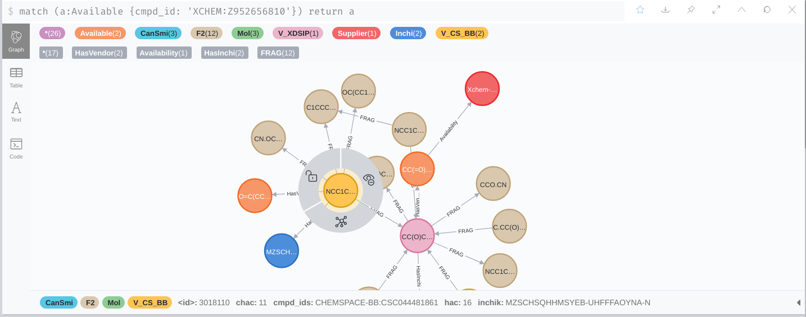

# A custom graph database for fragnet-search
This repository contains the commands necessary to create a Neo4j graph
database based on our [customised neo4j] container image.

You will need to supply your own data - don't worry we provide
a recipe here based on some sample data we can provide - or you can ask
us for some data that suits your needs.

The resultant graph can be used locally to run experimental tests or
published to a container registry and then pulled elsewhere for others to use.

>   To build the sample dataset image you will need a _decent_ workstation
    (at least 4 cores, 16Gi RAM) and at least 5GiB of free disk-space.

## The data files
This repository contains no actual graph data. The graph you want
is a choice you have to make.

Our _sample data_ is held pn AWS S3.

>   We rely on our [fragmentor] graph processing playbooks to generate input
    data. The process produces nodes and relationships and corresponding
    headers as well as a shell-script that is understood by our custom graph
    image that bulk-loads the files. Informatics Matters have libraries that
    can be used directly available on S3, but beware that these/graphs
    generated from these source files can be large.

## A sample dataset
We have already generated a sample test database.

Individual libraries are stored in our S3 bucket using a path
reflecting their `<vendor><version>` or `<vendor><library><version>`
name. Typically: -

    s3://im-fragnet/extract/molport/2020-12/
    s3://im-fragnet/extract/xchem/dsip/v1/

Combinations of libraries are stored under a suitable name in the bucket's
`extract/combination` folder. 

The small sample dataset can be found at: -

    s3://im-fragnet/extract/combination/xchem_combi_sample_2021_02/

This dataset consists of a combination of the xchem libraries and a sample of
500,000 chemspace vendor molecules. It has:

-   1796195 nodes
-   6532060 relationships (edges)

These values can be confirmed once the graph is running
with the following cypher commands: -

    match (n:F2) return count (n);
    match (n:F2)-[r:FRAG]->() return count (r);

The sample graph database contains the following **Node Labels**,
**Relationship Types** and **Property keys**: -
  

We have also published this database to Docker Hub:

    informaticsmatters/fragnet-test:3.5.25-xchem-combi-sample-2021-02

The image size is about 4GB.

## Building your own image
The repository contains no data so let's explain how to get our sample dataset
and launch a graph using it.

### Getting the sample dataset
To get the files from our bucket you can use the [AWS CLI]
(assuming you have suitable AWS credentials): -

    $ DATA_PATH=extract/combination/xchem_combi_sample_2021_02
    $ aws s3 sync s3://im-fragnet/"$DATA_PATH" data-loader

>   The input files go into the directory `data-loader`. This is not committed
    to Git and it (and the compiled data tha we'll build) is excluded by the
    project's `.gitignore`.

The above fileset (about 360MB) should contain 23 files, consisting
of a shell-script, 11 data files and 11 associated header files: -

    $ ls -1 data-loader | wc -l
    23

### Starting the graph container
With input data in place we just need to start the graph.

The graph database may take a few minutes to build indexes etc,
which will take a minute or two depending on the dataset and your workstation.

>   Large, complex datasets can take hours to compile. The sample dataset
    provided here should be ready after 3 or 4 minutes and consume about
    3-4GiB of disk space.

Ensure that you have no pre-existing graph by deleting the data directory it
creates (you may have to use sudo) and any pre-existing graph container: -

    $ rm -rf data
    $ docker rm fragnet-test

Now, build the custom graph image and start it...

    $ docker-compose build
    $ docker-compose up

The graph is ready to be used after you see the following on stdout: -

    fragnet-test | (cypher-runner.sh) [...] Finished.

You can use the graph now - it will be available at `http://localhost:7474`
with the username `neo4j` and password `test123`.

You can also stop (ctrl-c) and now quickly restart the graph
(`docker-compose up`), as the graph has been compiled into the local `data`
directory.

### Publishing the graph
If you need to publish the graph (to Docker Hub for example), for others to use,
you will need to build a new container image using the pre-compiled data
from the first.

the published image does not contain the original files, it just contains
the compiled database.

To build the container for publishing first stop (ctrl-c) the first graph.

>   The compiled graph files will be in the `data` directory of this project.

Now build the second container (providing a custom image tag) with: -

    $ rm data/databases/store_lock
    $ docker-compose -f docker-compose-two.yml rm graph-2
    $ IMAGE_TAG=3.5.25-xchem-combi-sample-2021-02 \
        docker-compose -f docker-compose-two.yml build

You can now start the new pre-compiled image with: -

    $ IMAGE_TAG=3.5.25-xchem-combi-sample-2021-02 \
        docker-compose -f docker-compose-two.yml up

Again, the graph is ready to use when you see the following: -

    fragnet-test-2 | (cypher-runner.sh) [...] Finished.

You can now also push the 2nd graph to docker hub, but remember that
this image may be substantial (about 3.3GiB): -

    $ IMAGE_TAG=3.5.25-xchem-combi-sample-2021-02 \
        docker-compose -f docker-compose-two.yml push

---

[aws cli]: https://pypi.org/project/awscli/
[customised neo4j]: https://github.com/InformaticsMatters/docker-neo4j
[fragalysis]: https://github.com/InformaticsMatters/fragmentor/
