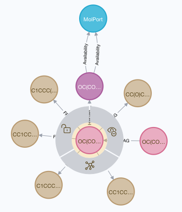

# A test database container image for fragnet-search
A graph database with built-in data based on our neo4j container image
used to run experimental tests with the fragnet search utility.

    $ docker-compose build
    $ docker-compose up
    
A simple test query for this database (and a screen shot of the results
when a few neighbouring nodes have been expanded) can be seen below: -

    match (a:Available {cmpd_id: 'MOLPORT:028-736-080'}) return a
    

## The data-loader files
We rely on our [fragalysis] graph processing playbooks to generate this
material. The files contained here should be in our S3 graph storage,
copied here for convenient building.

The origin of the current set of files is: -

    s3://im-fragnet/build/vendor/molport/2019-08/build-2

Consisting of: -

-   3,787 molecules
-   process_max_hac: 36
-   process_max_frag: 12
 
## Generating the data-loader files
We used the graph processor's Cylc `workflow` to run graph processing an a
small section of the original MolPort files. The parameters used
are in this project's `frag-processor-parameters` file and are run by placing
is file in the graph cluster's `~/play` directory.

## Getting the data-loader files
To get the files you can use the [AWS CLI]
(assuming you have suitable AWS credentials): -

    $ BUILD=vendor/molport/2019-08/build-2
    $ aws s3 sync s3://im-fragnet/build/"$BUILD" data-loader

The downloaded files may contain some extra files not needed by the graph
database. These have been excluded (not committed) so you wil need to do
the same if you install a new file-set...

    $ rm data-loader/nodes.csv.gz \
         data-loader/done \
         data-loader/*.prov \
         data-loader/*.txt \
         data-loader/*.html \
         data-loader/rejected* \
         data-loader/excluded*

## Publishing a compiled graph
The graph database may take a few minutes to build indexes etc. Once the graph
is stable you could push it to Docker and then re-use that published image
if you need faster start-up times.

`deploy.sh` will conveniently do the publishing of a **running container**
for you (if you provide it with a suitable tag). To publish the graph (which
is expected to be running) as the image
`informaticsmatters/fragnet-test:molport-2019-08-2` you'd run...

    $ ./publish.sh molport-2019-08-2

>   The utility checks that the fragnet-test image is running and then
    _commits_ and _pushes_ it with your chosen tag.

---

[aws cli]: https://pypi.org/project/awscli/
[fragalysis]: https://github.com/InformaticsMatters/fragalysis/tree/1-fragnet
