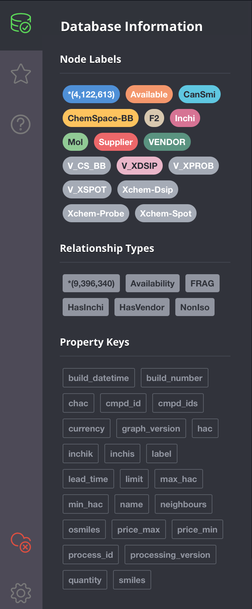

# Create a custom graph database for fragnet-search

This repository contains the commands necessary to create a Neo4j graph database with built-in data based on our 
neo4j container image. It can be used to run experimental tests with the fragnet search utility or potentially 
pulled into the fragalysis stack as a test graph database.
   
## The data-loader files
We rely on our [fragmentor] graph processing playbooks to generate this source information.
The files contained here should be taken from the output of these playbooks.
Informatics Matters have libraries that can be used directly available on S3, but beware that these/graphs 
generated from these source files can be large. 

Individual vendor libraries are stored in S3 under their <vendor><version> or <vendor><library><version>: -
e.g.

    s3://im-fragnet/extract/molport/2020-12/
    s3://im-fragnet/extract/xchem/dsip/v1/

Combinations of libraries are stored under a suitable name in the extract/combination folder. 

# Sample Dataset

We have already generated a sample test database with vectors in the following location: 

    s3://im-fragnet/extract/combination/xchem_combi_sample_2021_02/

This dataset consists of a combination of the xchem libraries and a sample of 500000 chemspace vendor molecules. It has:
1796195 nodes and
6532060 edges

A simple test query for this database (and a screen shot of the results
when a few neighbouring nodes have been expanded) can be seen below: -

    match (a:Available {cmpd_id: 'XCHEM:Z952656810'}) return a
    


This database is available as a docker image from Dockerhub at: 
informaticsmatters/fragnet-test:3.5.25-xchem-combi-sample-2021-02
It's a download of around 3GB.

## Getting the data-loader files
To get the files you can use the [AWS CLI]
(assuming you have suitable AWS credentials): -

    $ COMBI=extract/combination/xchem_combi_sample_2021_02
    $ aws s3 sync s3://im-fragnet/"$COMBI" data-loader

The downloaded fileset should contain the following files:
```
load-neo4j.sh 
inchi-nodes.csv.gz,                 header-inchi-nodes.csv 
isomol-molecule-edges.csv.gz,       header-isomol-molecule-edges.csv 
edges.csv.gz,                       header-edges.csv 
isomol-nodes.csv.gz,                header-isomol-nodes.csv 
molecule-inchi-edges.csv.gz,        header-molecule-inchi-edges.csv 
isomol-suppliermol-edges.csv.gz,    header-isomol-suppliermol-edges.csv 
molecule-suppliermol-edges.csv.gz,  header-molecule-suppliermol-edges.csv 
nodes.csv.gz,                       header-nodes.csv 
supplier-nodes.csv.gz,              header-suppliermol-nodes.csv 
suppliermol-supplier-edges.csv.gz,  header-suppliermol-supplier-edges.csv 
suppliermol-nodes.csv.gz,           header-supplier-nodes.csv 
```

## Publishing a compiled graph
The graph database may take a few minutes to build indexes etc. To speed
things up then you need to capture and publish a pre-built graph. To do
this you will need to run a two Docker build steps - one to start a graph
service and compile the data and the second to build an image from this
compiled data.

Follow the steps above to get your chosen data into the data-loader directory
and then run: -

    (sudo) rm -rf data
    docker-compose rm graph
    docker-compose build
    docker-compose up

Stop (ctrl-c) the running container after the database has compiled and the
cypher scripts have executed, i.e. after you see: -

    [...] Remote interface available at http://localhost:7474/

and...

    [...] Touching /data-loader/cypher-runner.executed...
    [...] Finished.

With the container stopped the compiled graph data will be in
the data directory of this project. Build the second container
with: -

    (sudo) rm data/databases/store_lock
    docker-compose -f docker-compose-two.yml rm graph-2
    IMAGE_TAG=3.5.25-xchem-combi-sample-2021-02 docker-compose -f docker-compose-two.yml build

You can start the new pre-compiled image with: -

    IMAGE_TAG=3.5.25-xchem-combi-sample-2021-02 docker-compose -f docker-compose-two.yml up

or push it to docker hub: -

    IMAGE_TAG=3.5.25-xchem-combi-sample-2021-02 docker-compose -f docker-compose-two.yml push

---

[aws cli]: https://pypi.org/project/awscli/
[fragalysis]: https://github.com/InformaticsMatters/fragmentor/
